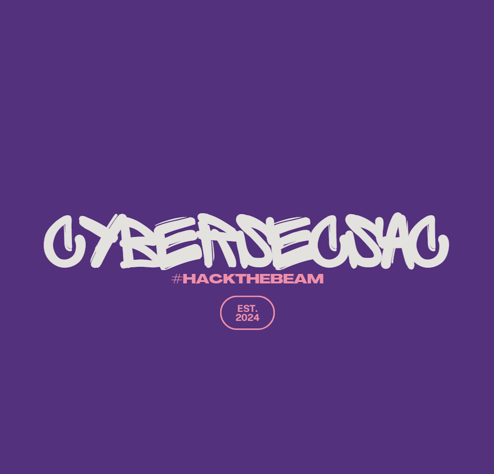

---

# About
A group in the greater Sacramento County area for hackers, makers, tinkerers and security enthusiats/professionals to meet and share projects/ideas. Current Leaders are Echo419 and [Kali Jackson](https://twitter.com/radicalkjax).

# Location
Sacramento, California
United States

---

# Meeting Schedule
Second Wednesday of the month at 7pm, with virtual meetings during August (hacker summer camp), and during November/December for the holidays.

# Meeting Location
Various businesses in the midtown Sacramento area.

---

# Areas of Interest
* Locking-picking
* Red-teaming
* ICS
* AgHacking
* Policy/Gov hacking

# Current Projects
* Badge and Hardware hacking
* CTFs
* Reverse Engineering

---

 Designed with love by Kali <3